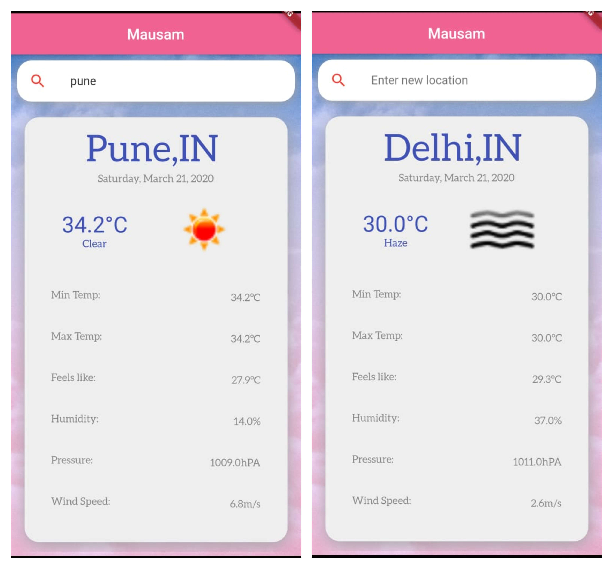

# mausam
Its a mobile application supported on both android and ios , it is based on flutter .
It uses openweather api to fetch data, the data is recieved in a JSON object . The data is decoded and displayed in a structed manner
you can also search for information about a particular location

